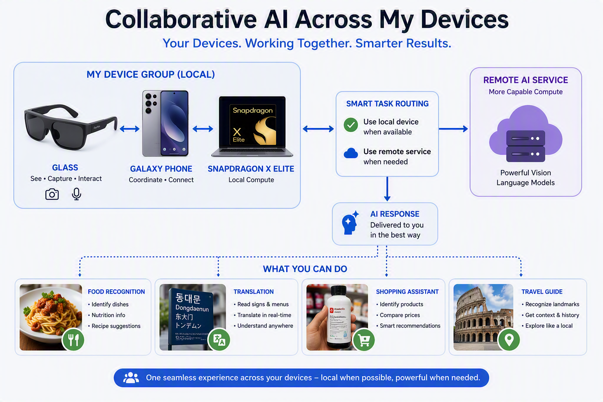
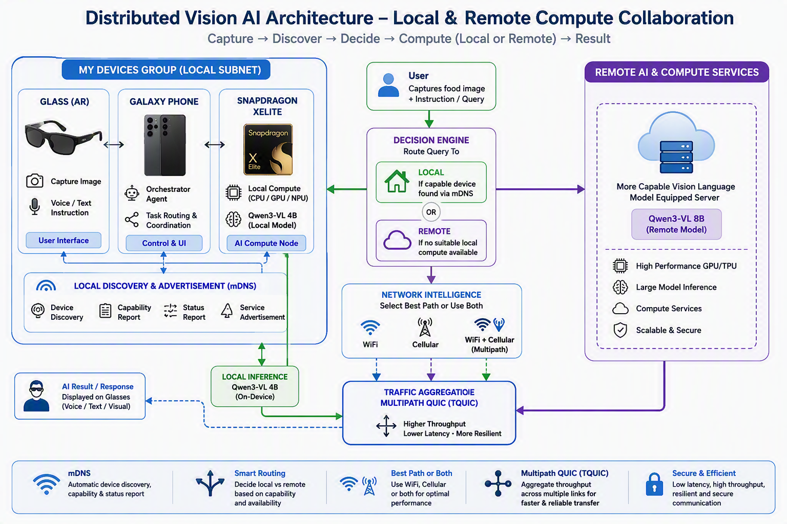
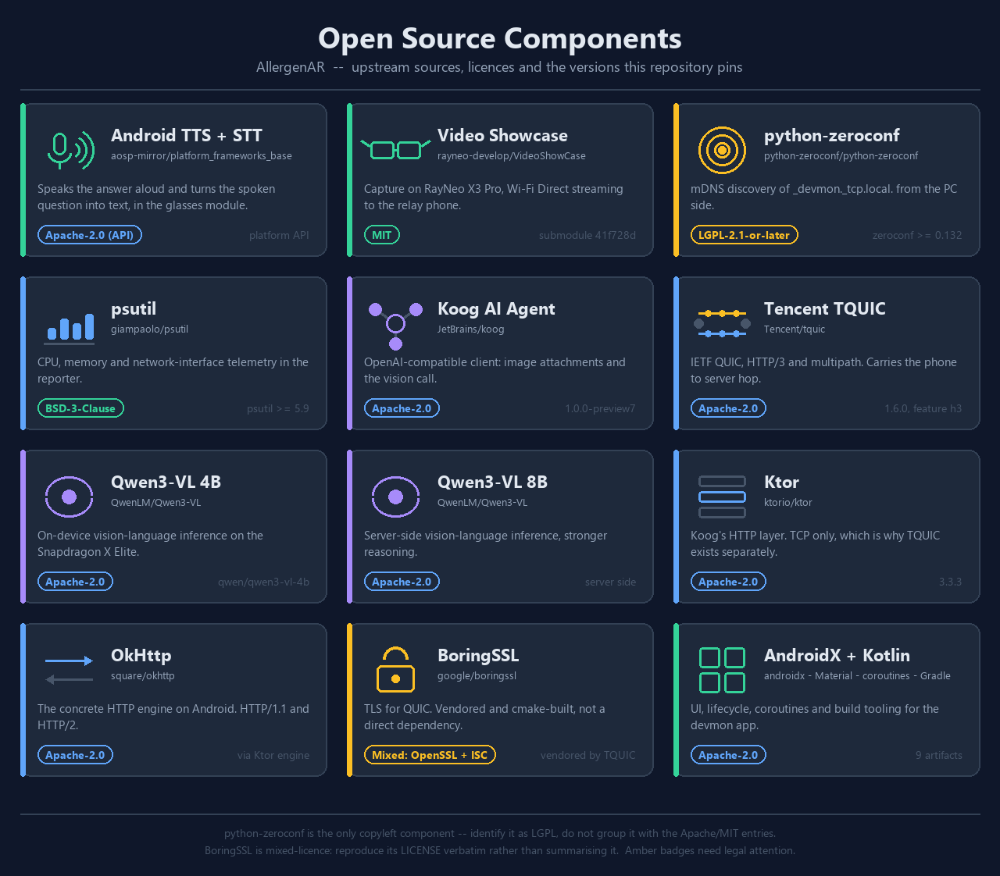

# AllergenAR — AI-Powered Allergen Detection with AR Glasses, Edge AI, and Multipath QUIC

<table>
<tr>
<td width="65%" valign="top">

> **"Local When Possible. Cloud When Needed. Safety Always."**

AllergenAR lets a person wearing RayNeo AR glasses look at any food, ask a spoken question ("Are there allergens in this?"), and receive an answer overlaid on their lens in seconds — without touching a phone.

A Samsung Galaxy S25 Ultra acts as the orchestration brain. It tries a nearby Snapdragon X Elite PC first (Qwen3-VL 4B, running locally via LM Studio, zero cloud cost, offline-capable). If no local host is found, it falls back transparently to an AWS EC2 server running Qwen3-VL 8B over a Multipath QUIC connection that rides Wi-Fi and 5G simultaneously, surviving a dropped network without dropping the request.

</td>
<td width="35%" valign="top">


</td>
</tr>
</table>



---

## Team

| Name | Email |
|---|---|
| Daniel Park | upnspark1@gmail.com |
| Chaitanya Mehta |  |
| Gautam Fotedar |  |
| Sukoon Sarin |  |
| Eunice Koh |  |

---
## Project Overview
AR Food Safety Companion: Distributed Edge-to-Cloud Vision AI with Adaptive Connectivity

Project Description
AR Food Safety Companion is a distributed AI-powered application that enables users to make informed food safety decisions using augmented reality glasses and multimodal vision-language models operating across local and cloud environments.

The solution leverages a heterogeneous device ecosystem consisting of AR glasses, Android smartphones, and Snapdragon X Elite PCs that collaborate as a local compute cluster. When a user captures an image of a food item and submits a query, the system dynamically determines whether the request should be processed locally or offloaded to a more powerful remote AI server hosting larger vision-language models.

To maximize performance and resiliency, devices automatically discover available local AI resources through mDNS-based service discovery. If suitable local compute resources are detected, queries are processed within the local network to minimize latency and reduce cloud dependency. When local resources are unavailable or insufficient, requests are seamlessly routed to remote AI services equipped with larger vision-language models and higher compute capacity.

The platform further enhances connectivity by intelligently utilizing both Wi-Fi and cellular networks. Depending on network conditions, traffic can be routed through the optimal path or transmitted concurrently across multiple paths. Multi-path transport enables throughput aggregation and improved responsiveness, delivering a seamless user experience even under varying network conditions.

The project demonstrates how distributed AI inference, adaptive networking, and edge computing can be combined to create practical real-world applications. In the AR Food Safety Companion use case, users receive real-time food safety insights while benefiting from the scalability of cloud AI and the responsiveness of local edge intelligence.


## End-to-End Architecture

```
RayNeo AR Glasses (com.example.video.show.glass)
  JPEG + transcribed question → TCP 8889, Wi-Fi Direct
  ↓
Samsung S25 Ultra – Phone App (com.example.video.show.demo)
  ├─ mDNS discovery: finds nearby AI host on LAN?
  │    YES → POST JPEG + query to LM Studio on Snapdragon X Elite (HTTP/1.1, LAN)
  │           Qwen3-VL 4B answers on-device, sub-second, no cloud
  │    NO  → Multipath QUIC (Wi-Fi + 5G simultaneously) to AWS EC2
  │           tquic-vlm-server-interface (Rust H3 server) → Ollama → Qwen3-VL 8B
  ↓
Answer rendered as AR overlay on glasses + spoken aloud by TTS
```

Supporting component — **devmon** (`local_llm/mdns/`): the Snapdragon X Elite advertises itself on the LAN via `_devmon._tcp.local.` (mDNS/NSD), letting the phone discover it automatically with no manual IP entry.




### Open Source Components



Upstream sources, licences and the exact versions this repository pins are documented in
**[OPEN-SOURCE-COMPONENTS.md](OPEN-SOURCE-COMPONENTS.md)** — including the two entries that need
legal attention: `python-zeroconf` (LGPL-2.1-or-later, the only copyleft component) and BoringSSL
(mixed OpenSSL/SSLeay + ISC).

---

## Repository Layout

| Path | What |
|---|---|
| `VideoShowCase/` | Git submodule — AR glasses app (`glass` module) + phone relay app (`app` module) |
| `mpquic/` | Multipath QUIC Android apps (client + server) + Linux CLI + Rust JNI bridge to Tencent `tquic` |
| `tquic-vlm-server-interface/` | Rust binary: QUIC/H3 server (Ubuntu x86_64) bridging requests to a local VLM |
| `local_llm/mdns/` | LAN device monitor — Windows/Python mDNS reporter + Android `devmon` app |
| `scripts/` | `adb`-based device setup and permission-granting helpers |
| `docs/` | Architecture specs, integration notes, presentation plans |

### Pre-built APKs (checked in)

| File | What |
|---|---|
| `mpquic/apks/client-debug.apk` | MPQUIC Android client app |
| `mpquic/apks/server-debug.apk` | MPQUIC Android server app |

---

## Setup from Scratch

### Prerequisites by component

| Component | Required tools |
|---|---|
| All Android apps | Android SDK (API 36), ADB in `PATH` |
| devmon / VideoShowCase | **JDK 17 or 21** on `JAVA_HOME` — AGP 8.7.3 breaks on JDK 25 |
| mpquic Android | JDK 17, Rust 1.90, `cargo-ndk`, Android NDK 27.2, CMake 3.22, VS Build Tools (Windows ARM64 host) |
| mpquic Linux CLI | Rust 1.90, `cmake`, `ninja-build`, `nasm`, `gcc` |
| tquic-vlm-server-interface | Rust 1.90, `build-essential cmake perl pkg-config` (Ubuntu x86_64) |
| Python reporter | Python 3.10+, `pip` |

### 1. Clone with submodules

```bash
git clone https://github.com/nparkgithub/hackathon26
cd hackathon26

# VideoShowCase submodule (needs SSH access to github.com:sukoonsarin/VideoShowCase)
git submodule update --init VideoShowCase

# tquic is vendored via crates.io — no submodule fetch needed for building
```

### 2. tquic-vlm-server-interface — Ubuntu x86_64 server

Initialize the vendored `tquic` submodule first (also needed by `mpquic-jni`, which this crate depends on for its `--mpquic-bind` tunnel mode):

```bash
git submodule update --init --recursive mpquic/tquic
```

```bash
sudo apt update && sudo apt install -y build-essential cmake perl pkg-config
curl --proto '=https' --tlsv1.2 -sSf https://sh.rustup.rs | sh -s -- -y
source "$HOME/.cargo/env"
# rust-toolchain.toml pins 1.90.0 — rustup installs it automatically

cd tquic-vlm-server-interface
cargo build --release
cargo test --release   # 15 tests, mocked, no network or real VLM needed
```

Open the QUIC port (UDP — not TCP):

```bash
sudo ufw allow 19500/udp
# and, if also using --mpquic-bind (see "MPQUIC apps" under Running and Usage), that port too:
sudo ufw allow 10000/udp
```

Full build gotchas (disk space, cross-compiling from non-x86_64, timing) are in [`tquic-vlm-server-interface/docs/build-guide.md`](tquic-vlm-server-interface/docs/build-guide.md).

### 3. mpquic Android apps — Windows ARM64 host (vcvarsall x64 shell required)

#### Toolchain

| Tool | Version | Install |
|---|---|---|
| Rust | 1.90.0 (pinned, `mpquic/mpquic-jni/rust-toolchain.toml`) | `rustup toolchain install 1.90.0` — auto-selected on `cd` into the crate |
| cargo-ndk | unpinned in-repo — any recent release | `cargo install cargo-ndk` |
| Android NDK | 27.2.12479018 | Android Studio → SDK Manager → SDK Tools → NDK (Side by side), or `sdkmanager --install "ndk;27.2.12479018"` |
| CMake | 3.22.1 | Android Studio → SDK Manager → SDK Tools → CMake, or `sdkmanager --install "cmake;3.22.1"` |
| Gradle | 8.13 — **manually provisioned, not a wrapper** | download from gradle.org and unzip to `mpquic/gradle-8.13/` (gitignored; every other Gradle project in this repo ships `./gradlew` — this one doesn't) |
| JDK | 17 (build used: Eclipse Adoptium `jdk-17.0.20.8-hotspot`) | install Eclipse Temurin 17 |
| VS Build Tools | unpinned | Visual Studio Installer → "Desktop development with C++" (provides `vcvarsall.bat` + x64 MSVC linker) |
| Android SDK | compileSdk/targetSdk 35, minSdk 26 | via Android Studio |

Why `vcvarsall x64`: the host is Windows on ARM64, but there's no ARM64 MSVC linker installed, so the build runs under the x64 toolchain (`x86_64-pc-windows-msvc`) inside a `vcvarsall.bat x64`-initialized shell (Start Menu → "x64 Native Tools Command Prompt", or run `vcvarsall.bat x64` yourself first).

#### Build setup

Before the first build, initialize the vendored `tquic` submodule (both this crate and the Linux CLI need it — not done automatically by a plain `git clone`):

```bat
git submodule update --init --recursive mpquic/tquic
```

Then, from a `vcvarsall x64` shell:

```bat
:: 1) Build native .so for both ABIs
set ANDROID_NDK_HOME=%LOCALAPPDATA%\Android\Sdk\ndk\27.2.12479018
set CMAKE_GENERATOR=Ninja
set PATH=%LOCALAPPDATA%\Android\Sdk\cmake\3.22.1\bin;%PATH%

cd mpquic\mpquic-jni
cargo ndk -t arm64-v8a -t x86_64 -o ..\android\core\src\main\jniLibs build --release

:: 2) Build APKs
set JAVA_HOME=C:\Program Files\Eclipse Adoptium\jdk-17.0.20.8-hotspot
cd ..\android
..\gradle-8.13\bin\gradle :client:assembleDebug :server:assembleDebug
```

`CMAKE_GENERATOR=Ninja` is required, not optional: BoringSSL's build (inside vendored `tquic`) needs it because of a locally-applied patch (`mpquic/patches/tquic-android-cross-build.patch`) that fixes a Windows→Android cross-build path bug — the upstream code checked the *host's* MSVC-ness instead of the *target's*, so without forcing Ninja it looks for BoringSSL's static libs in the wrong subdirectory.

APKs land in:
- `mpquic/android/client/build/outputs/apk/debug/client-debug.apk`
- `mpquic/android/server/build/outputs/apk/debug/server-debug.apk`

Pre-built copies are already at `mpquic/apks/`. Only debug builds are supported today — no release signing config exists in any module.

#### Testing without a device

The engine (`mpquic-jni`) that backs both the Android apps and the Linux CLI has real, non-mocked loopback test coverage:

```bash
cd mpquic/mpquic-jni
cargo test
```

6 tests: echo round-trip (IPv4 + IPv6), per-path byte accounting under the `redundant` scheduler, a connection surviving 3× its idle timeout via keepalive, a full HTTP/3-over-MPQUIC JPEG relay round-trip, and mixed-address-family local IPs being filtered out cleanly rather than crashing the engine.

The Android modules also have JVM-only unit tests (no device/emulator needed):

```bat
cd mpquic\android
..\gradle-8.13\bin\gradle :core:testDebugUnitTest
```

`NetUtilsTest` covers address-family filtering, carrier CGNAT/CLAT address exclusion, and host:port parsing; `UdpIngestTest` covers the UDP-RX ingest feature's bind/stop lifecycle. There are no automated on-device/instrumented tests for either app — `tquic-vlm-server-interface/docs/mpquic-tunnel-verification.md` is the closest thing to device-level verification, and it's a manual runbook, not automation.

### 4. mpquic Linux CLI

#### Toolchain

| Tool | Version | Install |
|---|---|---|
| Rust | 1.90.0 (pinned, `mpquic/linux/mpquic-cli/rust-toolchain.toml`) | `rustup toolchain install 1.90.0` |
| cmake | any recent | `sudo apt install -y cmake` |
| ninja-build | any recent | `sudo apt install -y ninja-build` — forces the `cmake` crate to emit Ninja files for BoringSSL's build |
| nasm | any recent | `sudo apt install -y nasm` |
| gcc / g++ | native: `gcc`; cross: `gcc-x86-64-linux-gnu` + `g++-x86-64-linux-gnu` | `sudo apt install -y gcc` (native) |
| perl | any recent (usually preinstalled on Ubuntu) | `sudo apt install -y perl` — used by BoringSSL's build scripts; not previously listed here but genuinely required |

Prebuilt binaries are already checked in at `mpquic/linux/bin/x86_64/` — most developers don't need to build this at all.

#### Build setup

Initialize the vendored `tquic` submodule first (shared with the Android build):

```bash
git submodule update --init --recursive mpquic/tquic
```

**Native x86-64 build:**

```bash
sudo apt install -y cmake ninja-build nasm gcc perl
cd mpquic/linux/mpquic-cli
cargo build --release
# binaries: target/release/mpquic-{client,server}
```

**Cross-compiling from an aarch64 Linux host:**

```bash
sudo apt install cmake ninja-build nasm gcc-x86-64-linux-gnu g++-x86-64-linux-gnu perl
rustup target add x86_64-unknown-linux-gnu
cd mpquic/linux/mpquic-cli
export CC_x86_64_unknown_linux_gnu=x86_64-linux-gnu-gcc
export CXX_x86_64_unknown_linux_gnu=x86_64-linux-gnu-g++
export AR_x86_64_unknown_linux_gnu=x86_64-linux-gnu-ar
export CARGO_TARGET_X86_64_UNKNOWN_LINUX_GNU_LINKER=x86_64-linux-gnu-gcc
export CMAKE_GENERATOR=Ninja
cargo build --release --target x86_64-unknown-linux-gnu
```

**Or use the turnkey script**, which does all of the above and can also smoke-test the result:

```bash
bash mpquic/linux/build_x86_64.sh               # cross-build, copies binaries into mpquic/linux/bin/x86_64/
bash mpquic/linux/build_x86_64.sh --native-test  # also runs a same-arch build + loopback smoke test
```

> **Gotcha**: this build shells out to `cmake`/BoringSSL, which can fail on a path containing spaces. `build_x86_64.sh` works around this by `rsync`ing sources to `~/mpquic-build` first; if building manually from a path with a space in it (e.g. a Windows-mounted path like `/mnt/c/Users/<first> <last>/...`), do the same — build from a spaces-free path instead.

#### Testing without a device

The `mpquic-cli` crate itself has no dedicated tests — it's a thin frontend. All real coverage lives in the shared engine: the same `cargo test` in `mpquic/mpquic-jni` covered under the Android section above (6 tests) applies here unchanged, since both consume the identical engine.

The one thing that exercises the actual compiled `mpquic-client`/`mpquic-server` binaries is the turnkey script's smoke test:

```bash
bash mpquic/linux/build_x86_64.sh --native-test
# builds natively, starts mpquic-server, runs mpquic-client --send-mb 1 --oneshot against it,
# greps the client log for "send complete" and "recv" -> SMOKE TEST PASSED/FAILED
```

### 5. devmon Android app (LAN device monitor / mDNS advertiser)

```bash
cd local_llm/mdns/devmon
./gradlew assembleDebug
# APK: app/build/outputs/apk/debug/app-debug.apk
```

Requires JDK 17 or 21 on `JAVA_HOME`. Create `local.properties` in `devmon/`:

```
sdk.dir=/path/to/android/sdk
```

### 6. Python reporter (Windows, LAN device monitor)

```powershell
cd local_llm\mdns
py -m venv .venv
.venv\Scripts\python -m pip install -r requirements.txt
```

If `pip install` fails with `SSLCertVerificationError` behind a corporate proxy, run once with:

```powershell
.venv\Scripts\python -m pip install --trusted-host pypi.org --trusted-host files.pythonhosted.org -r requirements.txt
```

### 7. Device setup (after installing APKs)

```bash
# Grant permissions and configure both glasses and phone for demo
./scripts/glass_dev_setup.sh both

# If targeting a specific device: DEVICE_SERIAL=<serial> ./scripts/glass_dev_setup.sh glass
```

---

## ARFood — the Glasses and Phone Apps (`VideoShowCase/`)

The two apps a judge interacts with directly. Both live in the `VideoShowCase` git
submodule as one Gradle project with two modules.

**Glasses app** (`glass` module → RayNeo X3): the wearable front end. One tap on the
touchpad captures a photo, transcribes your spoken question on-device, and sends both to
the phone over Wi-Fi Direct. The answer comes back onto the lens, colour-coded by
verdict (white = safe, red = not safe, amber = check first), and is read aloud —
tap once to stop the speech.

**Phone app** (`app` module → any Android 12+ phone, "ARFood"): the orchestration brain.
It hosts the Wi-Fi Direct group, receives each capture, checks the food against the
on-device allergy profile (peanuts, tree nuts, shellfish by default) via a vision model,
and routes each request to whichever backend is healthy — the local PC over HTTP/1.1, or
the cloud over hand-written HTTP/3 through the MPQUIC tunnel. The screen shows a live
session history: every capture with its photo, question, verdict pill and timestamp,
plus which compute path answered it.

### Build

Requires JDK 17 or 21 on `JAVA_HOME` and the Android SDK (set `ANDROID_HOME`, or put
`sdk.dir=` in `VideoShowCase/local.properties`).

```bash
git submodule update --init VideoShowCase   # if you haven't already
cd VideoShowCase
./gradlew :app:assembleDebug :glass:assembleDebug
```

APKs land at:

- Phone — `app/build/outputs/apk/debug/app-debug.apk`
- Glasses — `glass/build/outputs/apk/debug/glass-debug.apk`

### Install

With the phone and the RayNeo X3 both attached over adb (`adb devices` shows two serials):

```bash
adb -s <PHONE_SERIAL>   install -r app/build/outputs/apk/debug/app-debug.apk
adb -s <GLASSES_SERIAL> install -r glass/build/outputs/apk/debug/glass-debug.apk

# grant camera/mic/nearby-device permissions on both in one step:
cd .. && ./scripts/glass_dev_setup.sh both
```

(Without the script, accept the runtime permission prompts on first launch instead.)

### Run

Have at least one backend up first — the local host (Step 1 below) or the cloud path
(Step 2). The phone app picks whichever is healthy on its own.

1. **Phone** — open **ARFood**, tap the **⋮ menu → start the Wi-Fi Direct group**.
   The status card reads *"Group created. Waiting for camera device…"*.
2. **Glasses** — open the app, pick **Discover devices**, and select the phone when it
   appears. The phone's status flips to *"Glasses connected"* and shows the capture
   resolution; on the lens, choose **Capture + query**.
3. **Ask** — look at the food, tap **"Tap to capture and ask"**, and speak
   ("Can I eat this?"). The lens shows the query being transcribed, then
   *Waiting for answer…* on both screens.
4. **Answer** — in roughly 10–20 s the verdict lands on the lens and is spoken aloud;
   the phone shows the same answer with a SAFE FOR YOU / NOT SAFE FOR YOU /
   CHECK BEFORE EATING pill, and the *Compute* line names the path that served it
   (local DevMon → PC, or remote TQUIC → EC2). Tap any history row to revisit it;
   tap a photo to read a label full-screen; **Cancel** abandons a slow request.

To see the failover live: answer one query with the local host up, stop the local
host, and ask again — the next capture routes to the cloud with no reconfiguration,
visible on the *Compute* line.

A finished demo film and slide deck are in [`demo/`](demo/).

---

## Running and Usage

### AllergenAR demo — full end-to-end

**Step 1 — Start the local AI host (Snapdragon X Elite or any LAN PC, Windows)**

1. Install [LM Studio](https://lmstudio.ai) for Windows.
2. In the model search tab, download `Qwen/Qwen3-VL-4B-Instruct` (`Q4_K_M` quant — matches `local_llm/mdns/llm_info.json`).
3. Open the **Developer** tab → **Local Server**:
   - Load the model, with context length `8192`.
   - Leave the port at its default, `1234`.
   - Enable **"Serve on Local Network"** — without this it binds to `127.0.0.1` only, and the phone (on the LAN, not loopback) can't reach it.
4. Allow the port through Windows Firewall if prompted, or from an elevated prompt:
   ```powershell
   netsh advfirewall firewall add rule name="LM Studio" dir=in action=allow protocol=TCP localport=1234
   ```
5. From another machine on the same LAN, verify: `curl http://<PC-LAN-IP>:1234/v1/models`.
6. Edit `local_llm/mdns/llm_info.json` if the loaded model differs from the checked-in label (`qwen/qwen3-vl-4b`, `Q4_K_M`, `8192`, `vision: true`) — the phone displays these fields verbatim.
7. Start the Python reporter, pointing it at LM Studio's port:
   ```powershell
   cd local_llm\mdns
   .venv\Scripts\python discover_and_report.py --openai-port 1234
   ```
8. Install the `devmon` APK on an Android device (or emulator) attached to the same Wi-Fi, start it, and tap **Start Advertising**. The phone will now discover this host — and LM Studio's LAN address and port via the reporter's telemetry — automatically.

**Step 2 — (Optional) Start the cloud fallback on AWS EC2 (Ubuntu, Ollama + tquic-vlm-server-interface)**

1. Launch an Ubuntu 26.04 EC2 instance. A GPU instance (e.g. `g6.xlarge`) is recommended for reasonable Qwen3-VL 8B latency; CPU-only works but answers more slowly.
2. In the instance's security group, allow inbound UDP on the QUIC port (`19500` by default) from the phone's network — see [Networking Notes](#networking-notes). Ollama's port (`11434`) stays loopback-only and does **not** need a security-group rule.
3. **GPU instances only** — install the NVIDIA driver so Ollama can see the GPU (skip on CPU-only instances):
   ```bash
   sudo apt update
   sudo apt install -y ubuntu-drivers-common
   sudo ubuntu-drivers autoinstall
   sudo reboot
   ```
   After the instance comes back up, confirm the driver loaded: `nvidia-smi`. Without this step Ollama runs on CPU with no error or warning.
4. Install Ollama and pull the model:
   ```bash
   curl -fsSL https://ollama.com/install.sh | sh
   ollama pull qwen3-vl:8b
   ```
5. Verify Ollama's OpenAI-compatible API locally: `curl http://127.0.0.1:11434/v1/models`. On a GPU instance, `ollama ps` should show `100% GPU` for the loaded model.
6. Build `tquic-vlm-server-interface` per [step 2 above](#2-tquic-vlm-server-interface--ubuntu-x8664-server) if you haven't already, then run it pointed at Ollama:
   ```bash
   ./target/release/tquic-vlm-server-interface \
     --bind 0.0.0.0:19500 \
     --vlm-base-url http://127.0.0.1:11434/v1 \
     --vlm-model qwen3-vl:8b
   # --help lists all flags: congestion control, body-size cap, timeouts, mpquic scheduler
   ```
7. Confirm that the EC2 security group allow inbound UDP on the bind port before testing from the phone.

**Step 3 — Start the phone app and glasses app**

Build, install and pair the two apps as described in
[ARFood — the Glasses and Phone Apps](#arfood--the-glasses-and-phone-apps-videoshowcase):
create the Wi-Fi Direct group from the phone's menu, then discover and select the phone
from the glasses.

**Step 4 — Ask a question**

Wear the glasses, look at food, tap **"Tap to capture and ask"**, and ask aloud
"Can I eat this?". The glasses send the JPEG + transcript to the phone, the phone routes
it locally or to cloud, and the verdict appears on the lens — colour-coded and spoken
aloud, with the full answer and compute path mirrored in the phone's session history.

---

### MPQUIC apps — standalone Multipath QUIC demo

Install the pre-built APKs:

```bash
adb install mpquic/apks/server-debug.apk
adb install mpquic/apks/client-debug.apk
```

**Server app**: enter a listen address (default `0.0.0.0:4433`), pick scheduler (`minrtt` / `redundant` / `roundrobin`), congestion control (`bbr` / `cubic` / `bbr3` / `copa`), and log level (`off`…`trace`); leave **Multipath** and **Echo** on (echo sends received payload straight back on its own path — useful for the throughput demo); tap **Start**. A server can accept more than one client connection at once — its log/stats lines are prefixed `conn#<index>` to tell them apart.

**Client app**: enter the server as `<server-IP>:4433`. Optionally set a second, different-address-family remote address (e.g. an IPv6 address alongside an IPv4 primary) so a cellular-only path can still join the connection under carrier CGNAT/464xlat. The local-IP list pre-fills with every local interface (Wi-Fi + cellular); pick scheduler/congestion-control/log-level to match, leave **Multipath** on, choose a bulk-send size from the fixed steps (1 / 2 / 5 / 10 / 25 / 30 / 40 / 50 / 100 MB), tap **Connect**, then **Send** (or **Send bulk**). Disconnecting resets the UI automatically — **Connect** re-enables as soon as the `disconnected` event fires, no app restart needed.

Per-path graphs (bytes/s per interface) update every 2 s, computed client-side from successive `stats` events. Kill Wi-Fi mid-transfer to watch traffic shift to cellular in real time.

**Reading the on-screen log** — both apps print the same event vocabulary the Linux CLI emits (see the flag reference below): `connected`, `path_added` / `path_skipped` (with a reason, e.g. address-family mismatch), `data`, `stats`, `send_complete` (per-path byte/packet totals), `h3_listening` / `h3_request` / `h3_response` / `h3_error`, `error`, `disconnected`, `stopped`. Logs are also written to a file, shown as "Log — file: `<path>`" above the log pane.

**On-device log files** need one-time storage access (harmless to skip — logging silently falls back to the app's private scoped storage otherwise):
```bash
adb shell appops set <package-name> MANAGE_EXTERNAL_STORAGE allow
# package-name: com.mpquic.client or com.mpquic.server
```

**H3 tunnel mode** — pipe JPEG images over MPQUIC from a desktop:

```bash
# On the client device: tap "Start HTTP/3 RX" (default port 47443)
# From a desktop on the same network:
pip install aioquic
python mpquic/tools/h3_sender.py <client-ip> photo.jpg
# or: python mpquic/tools/h3_sender.py <client-ip> --size-mb 4
```

**UDP RX mode** — separately, the client can also ingest plain UDP datagrams on a local port and forward each one over the MPQUIC connection as payload (enter a port, tap the UDP toggle) — distinct from the JPEG-oriented H3 tunnel above, useful for piping arbitrary local UDP traffic through the multipath link.

**Connecting to `tquic-vlm-server-interface` instead of another Android app** — the client app's server address doesn't have to be another Android device. Pointed at a real `tquic-vlm-server-interface` instance running in MPQUIC-tunnel-terminus mode, this is the actual cloud-fallback path AllergenAR uses in production, not just a loopback demo:

```bash
# On the server box (Ubuntu, Ollama already running — see step 2 above), in addition to --bind:
./target/release/tquic-vlm-server-interface \
  --bind 0.0.0.0:19500 \
  --mpquic-bind 0.0.0.0:10000 \
  --vlm-base-url http://127.0.0.1:11434/v1 \
  --vlm-model qwen3-vl:8b
```

On the client app, **Connect** to `<server-IP>:10000` (the `--mpquic-bind` port, not `--bind`'s — those are two independent UDP listeners in the same process), then use **H3 tunnel mode** above instead of a raw **Send**: whatever's POSTed to the client's local HTTP/3 RX port gets tunneled to the server and forwarded verbatim to the VLM backend, with the response relayed all the way back. The full step-by-step (building a real OpenAI-shaped image request, expected log output on all three machines) is in [`tquic-vlm-server-interface/docs/mpquic-tunnel-verification.md`](tquic-vlm-server-interface/docs/mpquic-tunnel-verification.md) — worth reading before trying this path for the first time, since a `--mpquic-bind` UDP port needs its own firewall/security-group rule separate from `--bind`'s.

---

### MPQUIC Linux CLI — quick test

```bash
cd mpquic/linux

# Terminal 1 — echo server
bin/x86_64/mpquic-server --listen 0.0.0.0:4433 \
  --cert certs/server.crt --key certs/server.key

# Terminal 2 — client, send 5 MB, exit
bin/x86_64/mpquic-client --connect 127.0.0.1:4433 --send-mb 5 --oneshot

# Multipath: two local IPs, roundrobin scheduler
bin/x86_64/mpquic-client --connect <server-ip>:4433 \
  --local <local-ip-1>,<local-ip-2> --scheduler roundrobin --send-mb 10 --oneshot
```

`certs/server.crt`/`server.key` are the same self-signed demo cert/key the Android apps and `tquic-vlm-server-interface` use (`CN=mpquic`, not for production).

#### Full flag reference

Flag parsing is hand-rolled (`mpquic/linux/mpquic-cli/src/lib.rs`, no `clap`) — these `--help` usage strings are the complete, authoritative flag list; nothing else exists beyond them.

**`mpquic-server`** (default shown in parens):

| Flag | Meaning |
|---|---|
| `--listen <ip:port>` | bind address (`0.0.0.0:4433`) |
| `--cert FILE` / `--key FILE` | TLS pair (`server.crt` / `server.key`) |
| `--scheduler S` | `minrtt` \| `redundant` \| `roundrobin` (`minrtt`) |
| `--cc C` | `bbr` \| `cubic` \| `bbr3` \| `copa` (`bbr`) |
| `--log-level L` | `off`\|`error`\|`warn`\|`info`\|`debug`\|`trace` (`info`) |
| `--no-multipath` | disable multipath (on by default) |
| `--no-echo` | don't echo received payload back (echo on by default) |
| `--stats` | print per-second stats events |

**`mpquic-client`**:

| Flag | Meaning |
|---|---|
| `--connect <ip:port>` | server address — **required**; `[v6]:port` for IPv6 |
| `--local a,b,c` | local IPs, one QUIC path per IP (first = initial path) |
| `--scheduler S` / `--cc C` / `--log-level L` / `--no-multipath` / `--stats` | same as server |
| `--send-mb N` | send N MB of test payload once connected |
| `--message TEXT` | send TEXT once connected |
| `--h3-port N` | run a local HTTP/3 listener on port N; requests it receives (e.g. large JPEG POSTs) are tunneled over MPQUIC and the peer's response is returned |
| `--cert FILE` / `--key FILE` | TLS pair for that HTTP/3 listener |
| `--oneshot` | exit after the send-complete summary |

> **Gotcha**: an unrecognized `--scheduler`/`--cc` value is **not** rejected — it silently falls back to `minrtt`/`bbr` (`mpquic/mpquic-jni/src/config.rs`'s catch-all match arm). A typo like `--cc bbr2` runs fine, just not with the algorithm you meant.

Both binaries print the same JSON-ish event stream the Android apps' log panes show: `listening`, `connected`, `path_added` / `path_skipped`, `data`, `stats` (with `--stats`), `send_complete`, `h3_listening` / `h3_request` / `h3_response` / `h3_error`, `error`, `disconnected`, `stopped`.

---

### tquic-vlm-server-interface — testing without a phone

```bash
cd tquic-vlm-server-interface

# Unit tests (frame parser + mockito VLM client — no network needed)
cargo test

# End-to-end smoke test: start a stub OpenAI endpoint, then:
./target/release/tquic-vlm-test-client \
  --host 127.0.0.1 --port 19500 \
  --image path/to/food.jpg \
  --prompt "Are there any allergens in this dish?"

# Passthrough shape (pre-built OpenAI JSON body):
./target/release/tquic-vlm-test-client \
  --host 127.0.0.1 --port 19500 \
  --raw-body path/to/openai-request.json
```

---

### LAN device monitor (mDNS devmon + Python reporter)

```powershell
# Windows — discover nearby devmon instances and stream telemetry
cd local_llm\mdns
.venv\Scripts\python discover_and_report.py              # discover + connect + report
.venv\Scripts\python discover_and_report.py --list       # mDNS discovery only, then exit
.venv\Scripts\python discover_and_report.py --connect 192.168.1.42:47531  # skip mDNS
.venv\Scripts\python discover_and_report.py --scan  --openai-port 1234      # Actual use option with devices TCP-probe /24 (use when AP blocks mDNS multicast)
.venv\Scripts\python discover_and_report.py --interval 5 -q              # 5-second interval, quiet
```

Edit `local_llm/mdns/llm_info.json` to describe the local LLM(s) on this machine — these labels appear on the Android display:

```json
[
  {"name": "Qwen3-VL-4B-Instruct", "parameters": "4B", "quantization": "Q4_K_M", "context_length": 8192, "family": "qwen3-vl"}
]
```

---

## Networking Notes

- **mDNS (service discovery)** is link-local (TTL 1): both phone and host must be on the **same subnet**. Some corporate/guest networks block device-to-device multicast (AP client isolation) while unicast TCP still works — use `--scan` on the Python reporter as a fallback, or ensure devices are on the same non-isolated Wi-Fi.
- **QUIC transport** uses **UDP** port 19500 by default. Unlike the TCP paths, `adb forward` cannot tunnel it. Ensure the EC2 security group allows inbound UDP on that port.
- TLS is mandatory for QUIC; the demo uses a self-signed cert (`tquic-vlm-server-interface/certs/server.crt`). The phone connects with certificate verification disabled (demo posture — not for production).
- Real JPEG images from the RayNeo glasses are **3.8–4.2 MB**. Verify there is no restrictive body-size limit in any multipart handler if you modify that path.

---

## Key Wire Contracts (kept in sync manually — no shared schema)

| What | Files |
|---|---|
| Telemetry JSON fields | `local_llm/mdns/discover_and_report.py` ↔ `devmon/…/Telemetry.kt` |
| Fixed TCP port (47531) | `AdvertiserService.FIXED_PORT` ↔ `SCAN_PORT_DEFAULT` in reporter |
| JNI export names | `mpquic-jni/src/lib.rs` `#[no_mangle]` exports ↔ `TquicBridge.kt` `external fun` names |
| H3 request shapes | `tquic-vlm-server-interface/src/frames.rs` ↔ Android Koog client |

---

## Third-Party Components

See [`OPEN-SOURCE-COMPONENTS.md`](OPEN-SOURCE-COMPONENTS.md) for a full table of every open-source dependency, its upstream source, license, and version.

**License summary:**
- All Android and Rust components: Apache-2.0 or MIT
- `python-zeroconf` (mDNS discovery): **LGPL-2.1-or-later** — dynamic-linked, ship license text
- BoringSSL (vendored inside TQUIC): mixed OpenSSL/SSLeay + ISC — reproduce its `LICENSE` verbatim
- Qwen3-VL model weights (4B and 8B): Apache-2.0

---

## License

This project is released under the [MIT License](LICENSE).

```
MIT License

Copyright (c) 2026 AllergenAR Hackathon Team

Permission is hereby granted, free of charge, to any person obtaining a copy
of this software and associated documentation files (the "Software"), to deal
in the Software without restriction, including without limitation the rights
to use, copy, modify, merge, publish, distribute, sublicense, and/or sell
copies of the Software, and to permit persons to whom the Software is
furnished to do so, subject to the following conditions:

The above copyright notice and this permission notice shall be included in all
copies or substantial portions of the Software.

THE SOFTWARE IS PROVIDED "AS IS", WITHOUT WARRANTY OF ANY KIND, EXPRESS OR
IMPLIED, INCLUDING BUT NOT LIMITED TO THE WARRANTIES OF MERCHANTABILITY,
FITNESS FOR A PARTICULAR PURPOSE AND NONINFRINGEMENT. IN NO EVENT SHALL THE
AUTHORS OR COPYRIGHT HOLDERS BE LIABLE FOR ANY CLAIM, DAMAGES OR OTHER
LIABILITY, WHETHER IN AN ACTION OF CONTRACT, TORT OR OTHERWISE, ARISING FROM,
OUT OF OR IN CONNECTION WITH THE SOFTWARE OR THE USE OR OTHER DEALINGS IN THE
SOFTWARE.
```
