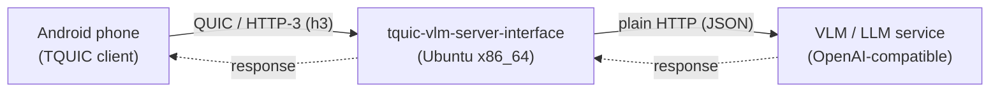

# tquic-vlm-server-interface — Feature and Interface Guide

This document describes what's implemented in `tquic-vlm-server-interface`, the standalone Rust QUIC/HTTP-3
server that runs on the Ubuntu x86_64 box, and the two interfaces it sits between:



It covers, in order: what's built, the server↔VLM interface, and the phone↔server interface
(wire protocol, data types, and the exact sequence of bytes on the wire).

---

## 1. Features implemented

| Area | What's there |
|---|---|
| **Transport** | QUIC + HTTP/3 server via the `tquic` 1.6.0 crate's native Rust API (not the C FFI) — no JNI, no JVM, a plain standalone binary. |
| **Reactor** | Single-threaded `mio`-based event loop (`src/reactor/mod.rs`) driving one server-only `tquic::Endpoint`. Modeled on `tquic-jni`'s reactor but simplified: no generation-tagged handle registry, no cross-thread command queue for the control plane — only the VLM-worker → reactor result channel is cross-thread. |
| **Wire protocol** | A single JSON body inside one H3 request, in one of two shapes distinguished by content sniffing: a simple `{"jpeg","prompt"}` request the server turns into an OpenAI-shaped call itself, or an already OpenAI-shaped request forwarded verbatim. See §3. |
| **VLM bridge** | Blocking HTTP client (`ureq`) calling a configurable OpenAI-compatible `/chat/completions` endpoint on its own worker thread per request, so a slow model call never blocks the QUIC reactor. See §2. |
| **Backpressure / flow control** | Handles `Http3Connection::send_body`'s partial-write contract itself (`PendingResponse` + retry each reactor turn) since there's no external caller to retry on the server's behalf. |
| **Concurrency cap** | `--max-inflight-vlm` bounds concurrent VLM worker threads; requests beyond the cap get an immediate `503` instead of unbounded thread spawning. |
| **Size limits** | `--max-body-bytes` (whole request body) enforced, with `413` on overflow — the sole size guard now that the body is one JSON document rather than TLV frames with their own per-field cap. |
| **TLS** | Self-signed EC P-256 / PKCS#8 cert, reused verbatim from the existing Android TQUIC demo (`certs/server.crt`/`server.key`). No client cert required, matching the demo's posture. |
| **Config** | Full CLI surface via `clap` — see §5. Nothing about bind address, cert paths, congestion control, timeouts, or the VLM backend is hardcoded. |
| **Error handling** | Every failure mode (malformed/unrecognized request shape, oversized body, VLM unreachable/timeout/bad response, server busy) maps to a specific H3 status + short text body — see §3.4. |
| **Testing** | Unit tests in `frames.rs` (shape-sniffing parser, both request shapes) and `vlm_client.rs` (both `infer` and `infer_raw`, each against a `mockito` mock) plus a standalone H3 test client (`src/bin/test_client.rs`) for full end-to-end smoke testing of either shape without a phone. |
| **Builds verified** | Compiles and passes all tests on both `aarch64-unknown-linux-gnu` (WSL, for fast iteration) and natively on a real `x86_64-unknown-linux-gnu` Ubuntu 26.04 box. End-to-end smoke test (real QUIC/H3/TLS handshake, real frame parsing, real HTTP call to a stub VLM) verified working on the x86_64 box. |

**Not yet done** (explicitly out of scope for this component): the Android side of the wire
protocol. The existing `tquic-demo-android` app's `TquicDemoController.kt` currently sends a TLV-framed
body (an earlier version of this protocol) — updating it to speak either JSON shape described in §3
is separate, later work; until then, every request from the Android app fails JSON parsing and gets
a `400`.

---

## 2. Interface: `tquic-vlm-server-interface` ↔ VLM/LLM service

This is a plain, synchronous HTTP call — deliberately not Rust-specific, so the VLM backend can be
implemented in any language that can serve a JSON HTTP endpoint (Python/FastAPI, a llama.cpp/vLLM
OpenAI-compatible server, Ollama, LM Studio, etc.). Implemented in `src/vlm_client.rs`.

### 2.1 Request

```
POST {--vlm-base-url}/chat/completions
Content-Type: application/json
```

Body (standard OpenAI vision chat-completion shape):

```json
{
  "model": "<--vlm-model>",
  "messages": [
    {
      "role": "user",
      "content": [
        { "type": "text", "text": "<the phone's prompt, verbatim>" },
        { "type": "image_url", "image_url": { "url": "data:image/jpeg;base64,<base64 of the JPEG bytes>" } }
      ]
    }
  ]
}
```

- The image is base64-encoded and embedded as a `data:` URI — no separate multipart upload, no file
  handles, just one JSON POST.
- `model` is passed through verbatim from `--vlm-model`; most local OpenAI-compatible servers accept
  any string here, but check the specific backend.

### 2.2 Expected response

Standard OpenAI chat-completion response shape. Only this path is read:

```json
{
  "choices": [
    { "message": { "content": "<the model's text answer>" } }
  ]
}
```

Rust-side deserialization types (`src/vlm_client.rs`):

```rust
struct ChatCompletionResponse { choices: Vec<Choice> }
struct Choice { message: Message }
struct Message { content: Option<String> }
```

Everything else in the response is ignored (usage stats, finish_reason, id, etc. — not read).

### 2.3 Config knobs

| Flag | Default | Meaning |
|---|---|---|
| `--vlm-base-url` | `http://127.0.0.1:8080/v1` | Base URL, no trailing slash, no `/chat/completions` suffix (appended automatically). Placeholder — nothing listens here until you point it at a real service. |
| `--vlm-model` | `local-vlm` | Placeholder model name. |
| `--vlm-timeout-ms` | `120000` | Per-call timeout — generous, since real VLM inference can be slow. |
| `--max-inflight-vlm` | `8` | Max concurrent calls to this endpoint (worker threads). |

### 2.4 Failure modes the VLM interface must expect from this side

None — the server never blocks the VLM service. All failure handling is on the `tquic-vlm-server-interface`
side (see §3.4): a slow/unreachable/erroring VLM backend just turns into an error response back to
the phone, never a crash or a stuck connection.

### 2.5 What the VLM interface must guarantee from its side

- Accept `POST /chat/completions` with the exact JSON shape in §2.1.
- Respond within `--vlm-timeout-ms` (or the request is treated as failed — the server does not retry).
- Return valid JSON matching §2.2 on success; any HTTP status outside 2xx is treated as a hard error
  (surfaced to the phone as `502`, including the response body text for debugging).
- Handle up to `--max-inflight-vlm` concurrent requests (default 8) — the server enforces this cap on
  its own side, so the backend will never see more concurrent calls than that from this component.

---

## 3. Interface: TQUIC Ubuntu server ↔ TQUIC Android client

This is the actual wire protocol between the phone and `tquic-vlm-server-interface`. It is **not** the same
thing as the `tquic-jni` JNI ABI (`TquicNative.kt`'s `external fun`s) — that's a Kotlin↔Rust
in-process call boundary on the phone. This section describes what goes **over the network**.

### 3.1 Transport / connection setup

| Parameter | Value | Notes |
|---|---|---|
| Protocol | QUIC + HTTP/3 | ALPN `h3` (configurable via `--alpn`, comma-separated list) |
| Server bind | `0.0.0.0:19500` (default, `--bind`) | UDP — must be allowed through any firewall/security group |
| TLS | Self-signed EC P-256, PKCS#8 key | `certs/server.crt` / `certs/server.key`, reused from the Android demo's own bundled cert |
| Client cert | Not required | Server never sets `requireClientCert` |
| Congestion control | `bbr` (default, `--congestion-control`) | One of `cubic`, `bbr`, `bbr3`, `copa`, `dummy` (tquic 1.6.0's supported set) |
| Idle timeout | `30000` ms (default, `--idle-timeout-ms`) | |
| Pacing / DPLPMTUD | Both enabled unconditionally | Matches `tquic-jni`'s server defaults |
| Multipath | Not exposed on the server side | The server ABI here takes no multipath parameters; multipath (if ever added) would be client-driven only, same as `tquic-jni`'s `addPath` |

**Certificate verification**: the server's cert has no SAN and is self-signed, so a real client must
connect with certificate verification disabled (`verifyPeer=false` in `tquic-jni` terms) — the same
posture the existing Android demo already uses. This is a deliberate "quick and insecure" choice
carried over from the demo, not a production TLS setup.

### 3.2 Request shape

One H3 request per inference call:

```
POST {--infer-path}          (default: /v1/infer)
```

No specific headers are required beyond what H3 needs (`:method`, `:path`, `:scheme`, `:authority`);
the server does not read `content-type` or any other header. The **body** carries everything.

### 3.3 Request body: two JSON shapes, told apart by content sniffing

The body is a single JSON document, in one of two shapes. The server checks which keys are present
— no separate endpoint, no discriminator field, no `Content-Type` inspection:

**Shape A — simple.** Present when both `"jpeg"` and `"prompt"` keys exist:

```json
{ "jpeg": "<base64-encoded JPEG bytes>", "prompt": "<UTF-8 text prompt>" }
```

The server decodes the base64, then builds the OpenAI-shaped request itself (§2.1) and calls the VLM
backend (`vlm_client::infer`) — same request-construction behavior this server has always had, just
fed by a JSON body instead of TLV frames.

**Shape B — OpenAI passthrough.** Present when both `"model"` and `"messages"` keys exist (and
`"jpeg"`/`"prompt"` are not both present — shape A is checked first):

```json
{ "model": "...", "messages": [ { "role": "user", "content": [ ... ] } ] }
```

The server does **not** reconstruct or validate this beyond the shape check — it's forwarded to
`{--vlm-base-url}/chat/completions` verbatim, byte-for-byte, including whatever `model` the client
chose (`vlm_client::infer_raw`). The client is responsible for producing a body the VLM backend will
actually accept.

A body matching neither shape (or matching shape A only partially — e.g. `"jpeg"` present but not a
string) is rejected: `FrameError::UnrecognizedShape`, surfaced as `400`. Same for plain JSON syntax
errors (`FrameError::InvalidJson`) and invalid base64 in a shape-A `"jpeg"` field
(`FrameError::InvalidBase64`).

Rust type produced on successful parse (`src/frames.rs::read_request`):
```rust
enum ParsedRequest {
    Simple { jpeg: Vec<u8>, prompt: String },
    OpenAiPassthrough(serde_json::Value),
}
```

**Whole-body buffering**: the server buffers the entire request body before parsing (bounded by
`--max-body-bytes`, default 32 MiB) — there's no incremental/streaming parse, since the JSON document
is expected to arrive as one short-lived request, not a long-lived stream.

### 3.4 Response shape

One H3 response per request, on the same stream. `Content-Type` varies by which shape was parsed on
a `200` — every non-200 response is `text/plain`:

```
Status: <see table>
Content-Type: text/plain (shape A success, and every error) | application/json (shape B success)
Body: <see table>
```

| Condition | Status | Content-Type | Body (example) |
|---|---|---|---|
| Success, shape A (simple) | `200` | `text/plain` | The VLM's extracted answer text, verbatim (`choices[0].message.content`) |
| Success, shape B (passthrough) | `200` | `application/json` | The VLM backend's **raw** JSON response, relayed unmodified — the client already understands this shape, since it built the request |
| Malformed/unrecognized request body | `400` | `text/plain` | `bad request: <FrameError detail>` |
| Wrong method (not `POST`) | `405` | `text/plain` | `method not allowed` |
| Wrong path (not `--infer-path`) | `404` | `text/plain` | `not found` |
| Body exceeds `--max-body-bytes` | `413` | `text/plain` | `payload too large` |
| `--max-inflight-vlm` cap reached | `503` | `text/plain` | `server busy, try again` |
| VLM backend unreachable | `502` | `text/plain` | `vlm backend error: could not reach VLM backend at <url>: <cause>` |
| VLM call exceeds `--vlm-timeout-ms` | `504` | `text/plain` | `vlm backend error: VLM backend request timed out after <duration>` |
| VLM backend returned non-2xx | `502` | `text/plain` | `vlm backend error: VLM backend returned HTTP <status>: <body>` |
| VLM response malformed/missing content (shape A only — shape B never inspects the response) | `502` | `text/plain` | `vlm backend error: ...` |
| TLS/handshake failure | *(no response — connection never reaches a stream)* | — | Client should observe a handshake timeout |

A client can distinguish "worked" from "didn't" with nothing more than the status code, matching how
the existing Android demo already branches (`200 -> Ok`, `else -> Failed(...)`) — no new client-side
parsing logic is required beyond that. A shape-B client additionally needs to parse the relayed JSON
itself to get at the answer text, same as it would talking to an OpenAI-compatible endpoint directly.

### 3.5 Full sequence, one request per shape

```mermaid
sequenceDiagram
    participant Phone as Android phone<br/>(TQUIC client)
    participant Server as tquic-vlm-server-interface<br/>(Ubuntu x86_64)
    participant VLM as VLM/LLM service<br/>(OpenAI-compatible)

    Phone->>Server: QUIC handshake (UDP, ALPN "h3", verifyPeer=false)
    Server-->>Phone: handshake complete
    Phone->>Server: H3 stream: POST /v1/infer (headers)
    Phone->>Server: body: {"jpeg": "<base64>", "prompt": "..."} (stream FIN)
    Note over Server: read_request() sniffs the shape (jpeg+prompt present),<br/>decodes base64 -> ParsedRequest::Simple
    Server->>VLM: POST {base_url}/chat/completions<br/>(server-built JSON: model + text + base64 image)
    Note over Server: request handed to a worker thread here —<br/>QUIC reactor keeps serving other connections
    VLM-->>Server: 200 OK, JSON {choices:[{message:{content:"..."}}]}
    Note over Server: infer() extracts choices[0].message.content;<br/>worker thread reports (text, "text/plain") back via mpsc + mio::Waker
    Server-->>Phone: H3 response: status 200,<br/>Content-Type: text/plain,<br/>body = extracted answer text
```

```mermaid
sequenceDiagram
    participant Phone as Android phone<br/>(TQUIC client)
    participant Server as tquic-vlm-server-interface<br/>(Ubuntu x86_64)
    participant VLM as VLM/LLM service<br/>(OpenAI-compatible)

    Phone->>Server: QUIC handshake (UDP, ALPN "h3", verifyPeer=false)
    Server-->>Phone: handshake complete
    Phone->>Server: H3 stream: POST /v1/infer (headers)
    Phone->>Server: body: {"model": "...", "messages": [...]} (stream FIN)
    Note over Server: read_request() sniffs the shape (model+messages present)<br/>-> ParsedRequest::OpenAiPassthrough(value), unexamined further
    Server->>VLM: POST {base_url}/chat/completions<br/>(phone's JSON body, forwarded byte-for-byte)
    Note over Server: request handed to a worker thread here —<br/>QUIC reactor keeps serving other connections
    VLM-->>Server: 200 OK, JSON {choices:[...], usage:{...}, ...}
    Note over Server: infer_raw() does NOT parse this;<br/>worker thread reports (raw body, "application/json") back via mpsc + mio::Waker
    Server-->>Phone: H3 response: status 200,<br/>Content-Type: application/json,<br/>body = VLM's raw JSON, unmodified
```

### 3.6 Data type summary

| Boundary | Representation |
|---|---|
| Phone → Server, shape A (simple) | `{"jpeg": "<base64>", "prompt": "<text>"}`, one JSON document |
| Phone → Server, shape B (passthrough) | `{"model": ..., "messages": [...]}`, one JSON document, OpenAI-shaped |
| Server (internal), parsed request | `ParsedRequest::Simple{jpeg,prompt}` or `ParsedRequest::OpenAiPassthrough(Value)` — `frames::read_request`'s return type |
| Server → VLM, shape A | Server-constructed JSON: base64 `data:image/jpeg;base64,...` URI + prompt text |
| Server → VLM, shape B | The phone's JSON body, forwarded unmodified (`vlm_client::infer_raw`) |
| VLM → Server, shape A | Plain JSON string field read out (`choices[0].message.content`) |
| VLM → Server, shape B | Not parsed at all — relayed as opaque bytes |
| Server → Phone, shape A success | UTF-8 text, H3 response body, `Content-Type: text/plain` |
| Server → Phone, shape B success | The VLM's raw JSON response body, verbatim, `Content-Type: application/json` |
| Server → Phone, error (either shape) | UTF-8 text, H3 response body, `Content-Type: text/plain` + a non-200 status code (see §3.4) |

---

## 4. Where each piece lives in the code

| Concern | File |
|---|---|
| CLI / config surface | `src/cli.rs` |
| tquic `Config`/`TlsConfig` construction | `src/server_config.rs` |
| Request shape-sniffing / JSON parsing (§3.3) | `src/frames.rs` |
| VLM HTTP call (§2) | `src/vlm_client.rs` |
| Error types + H3 status mapping (§3.4) | `src/error.rs` |
| QUIC/H3 reactor, connection/stream state | `src/reactor/mod.rs`, `src/reactor/conn_state.rs` |
| `TransportHandler` impl | `src/reactor/handler.rs` |
| UDP socket / `PacketSendHandler` impl | `src/reactor/socket.rs` |
| VLM-worker → reactor result channel | `src/reactor/vlm_bridge.rs` |
| Server entrypoint | `src/main.rs` |
| Standalone H3 test client (§ Testing) | `src/bin/test_client.rs` |

---

## 5. Full CLI reference

| Flag | Default | Meaning |
|---|---|---|
| `--bind` | `0.0.0.0:19500` | UDP address to bind the QUIC listener on |
| `--cert` | `certs/server.crt` | PEM cert path (EC P-256 recommended) |
| `--key` | `certs/server.key` | PEM private key path (PKCS#8) |
| `--alpn` | `h3` | Comma-separated ALPN list |
| `--congestion-control` | `bbr` | `cubic` \| `bbr` \| `bbr3` \| `copa` \| `dummy` |
| `--idle-timeout-ms` | `30000` | QUIC idle timeout |
| `--infer-path` | `/v1/infer` | H3 path this server accepts requests on |
| `--vlm-base-url` | `http://127.0.0.1:8080/v1` | VLM backend base URL |
| `--vlm-model` | `local-vlm` | Model name sent to the VLM backend |
| `--vlm-timeout-ms` | `120000` | Per-VLM-call timeout |
| `--max-inflight-vlm` | `8` | Concurrent VLM worker-thread cap |
| `--max-body-bytes` | `33554432` (32 MiB) | Max buffered request body size — sole size guard (one JSON document, not TLV frames) |

`RUST_LOG` (standard `env_logger` syntax, e.g. `RUST_LOG=debug`) controls log verbosity.

---

## 6. Testing

- **Unit tests** (`cargo test`): `frames.rs` (shape-sniffing round trips for both shapes, precedence
  when a body matches both, malformed JSON, invalid base64, unrecognized shape, non-object/non-string
  field types), `vlm_client.rs` (both `infer` and `infer_raw` — success, non-200, malformed JSON,
  missing content, empty choices, unreachable backend, and `infer_raw`'s body-forwarded-unmodified
  case specifically), all against a local `mockito` HTTP mock, no real network.
- **End-to-end smoke test** (`tquic-vlm-test-client`): `--image`/`--prompt` exercises shape A;
  `--raw-body <path>` sends a pre-built OpenAI-shaped JSON file verbatim to exercise shape B. Shape A
  previously verified against a stub OpenAI-compatible endpoint on the real Ubuntu x86_64 deployment
  target — full round trip returned `status=200` with the stub's canned answer.
- **Not yet tested**: the real Android app as the client (its `TquicDemoController.kt` doesn't speak
  either JSON shape yet — see the "Not yet done" note in §1), shape B against a real VLM/LLM backend,
  and a real VLM/LLM backend for shape A beyond the earlier stub run.
