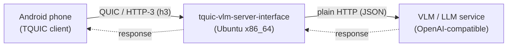
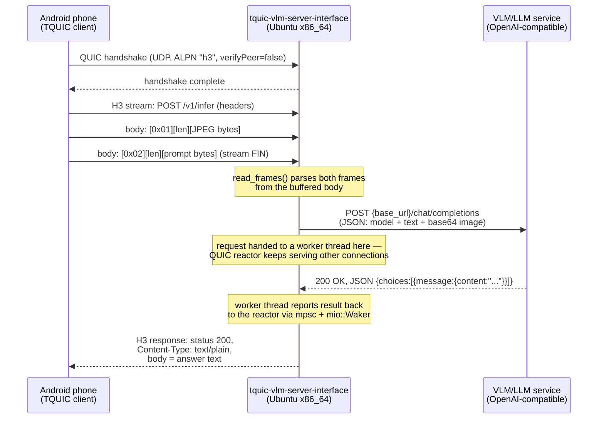

# tquic-vlm-server-interface — Feature and Interface Guide

This document describes what's implemented in `tquic-vlm-server-interface`, the standalone Rust QUIC/HTTP-3
server that runs on the Ubuntu x86_64 box, and the two interfaces it sits between:



It covers, in order: what's built, the server↔VLM interface, and the phone↔server interface
(wire protocol, data types, and the exact sequence of bytes on the wire).

---

## 1. Features implemented

| Area | What's there |
|---|---|
| **Transport** | QUIC + HTTP/3 server via the `tquic` 1.6.0 crate's native Rust API (not the C FFI) — no JNI, no JVM, a plain standalone binary. |
| **Reactor** | Single-threaded `mio`-based event loop (`src/reactor/mod.rs`) driving one server-only `tquic::Endpoint`. Modeled on `tquic-jni`'s reactor but simplified: no generation-tagged handle registry, no cross-thread command queue for the control plane — only the VLM-worker → reactor result channel is cross-thread. |
| **Wire protocol** | A fixed two-frame TLV body (image, then text) inside a single H3 request. See §3. |
| **VLM bridge** | Blocking HTTP client (`ureq`) calling a configurable OpenAI-compatible `/chat/completions` endpoint on its own worker thread per request, so a slow model call never blocks the QUIC reactor. See §2. |
| **Backpressure / flow control** | Handles `Http3Connection::send_body`'s partial-write contract itself (`PendingResponse` + retry each reactor turn) since there's no external caller to retry on the server's behalf. |
| **Concurrency cap** | `--max-inflight-vlm` bounds concurrent VLM worker threads; requests beyond the cap get an immediate `503` instead of unbounded thread spawning. |
| **Size limits** | `--max-body-bytes` (whole request body) and `--max-frame-bytes` (per TLV frame) both enforced, with `413` on overflow. |
| **TLS** | Self-signed EC P-256 / PKCS#8 cert, reused verbatim from the existing Android TQUIC demo (`certs/server.crt`/`server.key`). No client cert required, matching the demo's posture. |
| **Config** | Full CLI surface via `clap` — see §5. Nothing about bind address, cert paths, congestion control, timeouts, or the VLM backend is hardcoded. |
| **Error handling** | Every failure mode (malformed frame, oversized body, VLM unreachable/timeout/bad response, server busy) maps to a specific H3 status + short text body — see §3.4. |
| **Testing** | 15 unit tests (`frames.rs` TLV parser, `vlm_client.rs` HTTP logic against a `mockito` mock) plus a standalone H3 test client (`src/bin/test_client.rs`) for full end-to-end smoke testing without a phone. |
| **Builds verified** | Compiles and passes all tests on both `aarch64-unknown-linux-gnu` (WSL, for fast iteration) and natively on a real `x86_64-unknown-linux-gnu` Ubuntu 26.04 box. End-to-end smoke test (real QUIC/H3/TLS handshake, real frame parsing, real HTTP call to a stub VLM) verified working on the x86_64 box. |

**Not yet done** (explicitly out of scope for this component): the Android side of the wire
protocol. The existing `tquic-demo-android` app's `TquicDemoController.kt` only ever sends a
plain-text `POST /message` body to `127.0.0.1`. Making it speak the protocol in §3 — TLV-framed
body, dialing this server's real LAN IP/port — is separate, later work.

---

## 2. Interface: `tquic-vlm-server-interface` ↔ VLM/LLM service

This is a plain, synchronous HTTP call — deliberately not Rust-specific, so the VLM backend can be
implemented in any language that can serve a JSON HTTP endpoint (Python/FastAPI, a llama.cpp/vLLM
OpenAI-compatible server, Ollama, LM Studio, etc.). Implemented in `src/vlm_client.rs`.

### 2.1 Request

```
POST {--vlm-base-url}/chat/completions
Content-Type: application/json
```

Body (standard OpenAI vision chat-completion shape):

```json
{
  "model": "<--vlm-model>",
  "messages": [
    {
      "role": "user",
      "content": [
        { "type": "text", "text": "<the phone's prompt, verbatim>" },
        { "type": "image_url", "image_url": { "url": "data:image/jpeg;base64,<base64 of the JPEG bytes>" } }
      ]
    }
  ]
}
```

- The image is base64-encoded and embedded as a `data:` URI — no separate multipart upload, no file
  handles, just one JSON POST.
- `model` is passed through verbatim from `--vlm-model`; most local OpenAI-compatible servers accept
  any string here, but check the specific backend.

### 2.2 Expected response

Standard OpenAI chat-completion response shape. Only this path is read:

```json
{
  "choices": [
    { "message": { "content": "<the model's text answer>" } }
  ]
}
```

Rust-side deserialization types (`src/vlm_client.rs`):

```rust
struct ChatCompletionResponse { choices: Vec<Choice> }
struct Choice { message: Message }
struct Message { content: Option<String> }
```

Everything else in the response is ignored (usage stats, finish_reason, id, etc. — not read).

### 2.3 Config knobs

| Flag | Default | Meaning |
|---|---|---|
| `--vlm-base-url` | `http://127.0.0.1:8080/v1` | Base URL, no trailing slash, no `/chat/completions` suffix (appended automatically). Placeholder — nothing listens here until you point it at a real service. |
| `--vlm-model` | `local-vlm` | Placeholder model name. |
| `--vlm-timeout-ms` | `120000` | Per-call timeout — generous, since real VLM inference can be slow. |
| `--max-inflight-vlm` | `8` | Max concurrent calls to this endpoint (worker threads). |

### 2.4 Failure modes the VLM interface must expect from this side

None — the server never blocks the VLM service. All failure handling is on the `tquic-vlm-server-interface`
side (see §3.4): a slow/unreachable/erroring VLM backend just turns into an error response back to
the phone, never a crash or a stuck connection.

### 2.5 What the VLM interface must guarantee from its side

- Accept `POST /chat/completions` with the exact JSON shape in §2.1.
- Respond within `--vlm-timeout-ms` (or the request is treated as failed — the server does not retry).
- Return valid JSON matching §2.2 on success; any HTTP status outside 2xx is treated as a hard error
  (surfaced to the phone as `502`, including the response body text for debugging).
- Handle up to `--max-inflight-vlm` concurrent requests (default 8) — the server enforces this cap on
  its own side, so the backend will never see more concurrent calls than that from this component.

---

## 3. Interface: TQUIC Ubuntu server ↔ TQUIC Android client

This is the actual wire protocol between the phone and `tquic-vlm-server-interface`. It is **not** the same
thing as the `tquic-jni` JNI ABI (`TquicNative.kt`'s `external fun`s) — that's a Kotlin↔Rust
in-process call boundary on the phone. This section describes what goes **over the network**.

### 3.1 Transport / connection setup

| Parameter | Value | Notes |
|---|---|---|
| Protocol | QUIC + HTTP/3 | ALPN `h3` (configurable via `--alpn`, comma-separated list) |
| Server bind | `0.0.0.0:19500` (default, `--bind`) | UDP — must be allowed through any firewall/security group |
| TLS | Self-signed EC P-256, PKCS#8 key | `certs/server.crt` / `certs/server.key`, reused from the Android demo's own bundled cert |
| Client cert | Not required | Server never sets `requireClientCert` |
| Congestion control | `bbr` (default, `--congestion-control`) | One of `cubic`, `bbr`, `bbr3`, `copa`, `dummy` (tquic 1.6.0's supported set) |
| Idle timeout | `30000` ms (default, `--idle-timeout-ms`) | |
| Pacing / DPLPMTUD | Both enabled unconditionally | Matches `tquic-jni`'s server defaults |
| Multipath | Not exposed on the server side | The server ABI here takes no multipath parameters; multipath (if ever added) would be client-driven only, same as `tquic-jni`'s `addPath` |

**Certificate verification**: the server's cert has no SAN and is self-signed, so a real client must
connect with certificate verification disabled (`verifyPeer=false` in `tquic-jni` terms) — the same
posture the existing Android demo already uses. This is a deliberate "quick and insecure" choice
carried over from the demo, not a production TLS setup.

### 3.2 Request shape

One H3 request per inference call:

```
POST {--infer-path}          (default: /v1/infer)
```

No specific headers are required beyond what H3 needs (`:method`, `:path`, `:scheme`, `:authority`);
the server does not read `content-type` or any other header. The **body** carries everything.

### 3.3 Request body: the TLV frame protocol

Two length-prefixed frames, back to back, image first:

```
┌────────────┬──────────────────────┬─────────────────────┐
│ type (1B)  │ length (8B, BE u64)  │ payload (N bytes)    │   <- image frame
├────────────┼──────────────────────┼─────────────────────┤
│ type (1B)  │ length (8B, BE u64)  │ payload (M bytes)    │   <- text frame
└────────────┴──────────────────────┴─────────────────────┘
```

| Field | Value | Notes |
|---|---|---|
| Frame 1 `type` | `0x01` | Image (JPEG bytes, opaque — not validated as a real JPEG by this server) |
| Frame 2 `type` | `0x02` | Text prompt, must be valid UTF-8 |
| `length` | 8-byte **big-endian** unsigned integer | Exact byte count of the following payload |

Rules (enforced by `src/frames.rs::read_frames`, all violations rejected — see §3.4 for status codes):

- Frames must appear in this exact order: image, then text. Wrong type at either position is rejected.
- A `length` that runs past the end of the actual body is rejected (`LengthOverflow`) — checked
  *before* any slicing/allocation, so a lying length can't cause an out-of-bounds read.
- A `length` exceeding `--max-frame-bytes` (default 32 MiB) is rejected (`TooLarge`), independent of
  whether the body actually contains that many bytes.
- The text frame's payload must be valid UTF-8.
- No bytes may follow the two frames — this is a fixed two-frame protocol, not an extensible one;
  trailing bytes are rejected rather than silently ignored.
- Empty image or empty text frames are structurally valid (0-length is a legal `length` value) — the
  framing layer doesn't judge content, only structure. A downstream empty prompt/image is the VLM
  backend's problem, not this server's.

Rust type produced on successful parse: `(Vec<u8> /* jpeg */, String /* prompt */)`.

**Whole-body buffering**: the server buffers the entire request body before parsing (bounded by
`--max-body-bytes`, default 32 MiB) — there's no incremental/streaming parse, since both frames are
expected to arrive as one short-lived request, not a long-lived stream.

### 3.4 Response shape

One H3 response per request, on the same stream:

```
Status: <see table>
Content-Type: text/plain
Body: <UTF-8 text — the VLM's answer on success, a short error message otherwise>
```

| Condition | Status | Body text (example) |
|---|---|---|
| Success | `200` | The VLM's answer, verbatim |
| Malformed frame (bad type/length/UTF-8/trailing bytes) | `400` | `bad request: <FrameError detail>` |
| Wrong method (not `POST`) | `405` | `method not allowed` |
| Wrong path (not `--infer-path`) | `404` | `not found` |
| Body exceeds `--max-body-bytes` | `413` | `payload too large` |
| `--max-inflight-vlm` cap reached | `503` | `server busy, try again` |
| VLM backend unreachable | `502` | `vlm backend error: could not reach VLM backend at <url>: <cause>` |
| VLM call exceeds `--vlm-timeout-ms` | `504` | `vlm backend error: VLM backend request timed out after <duration>` |
| VLM backend returned non-2xx | `502` | `vlm backend error: VLM backend returned HTTP <status>: <body>` |
| VLM response malformed/missing `choices[0].message.content` | `502` | `vlm backend error: ...` |
| TLS/handshake failure | *(no response — connection never reaches a stream)* | Client should observe a handshake timeout |

A client can distinguish "worked" from "didn't" with nothing more than the status code, matching how
the existing Android demo already branches (`200 -> Ok`, `else -> Failed(...)`) — no new client-side
parsing logic is required beyond that.

### 3.5 Full sequence, one request



### 3.6 Data type summary

| Boundary | Representation |
|---|---|
| Phone → Server, image | Raw JPEG bytes, length-prefixed (frame type `0x01`) |
| Phone → Server, prompt | UTF-8 text, length-prefixed (frame type `0x02`) |
| Server (internal), parsed request | `(Vec<u8>, String)` — `frames::read_frames`'s return type |
| Server → VLM, image | Base64 string embedded in a `data:image/jpeg;base64,...` URI, inside JSON |
| Server → VLM, prompt | Plain JSON string field (`content[0].text`) |
| VLM → Server, answer | Plain JSON string field (`choices[0].message.content`) |
| Server → Phone, answer | UTF-8 text, H3 response body (no framing — one response = one complete answer) |
| Server → Phone, error | UTF-8 text, H3 response body + a non-200 status code (see §3.4) |

---

## 4. Where each piece lives in the code

| Concern | File |
|---|---|
| CLI / config surface | `src/cli.rs` |
| tquic `Config`/`TlsConfig` construction | `src/server_config.rs` |
| TLV frame parsing (§3.3) | `src/frames.rs` |
| VLM HTTP call (§2) | `src/vlm_client.rs` |
| Error types + H3 status mapping (§3.4) | `src/error.rs` |
| QUIC/H3 reactor, connection/stream state | `src/reactor/mod.rs`, `src/reactor/conn_state.rs` |
| `TransportHandler` impl | `src/reactor/handler.rs` |
| UDP socket / `PacketSendHandler` impl | `src/reactor/socket.rs` |
| VLM-worker → reactor result channel | `src/reactor/vlm_bridge.rs` |
| Server entrypoint | `src/main.rs` |
| Standalone H3 test client (§ Testing) | `src/bin/test_client.rs` |

---

## 5. Full CLI reference

| Flag | Default | Meaning |
|---|---|---|
| `--bind` | `0.0.0.0:19500` | UDP address to bind the QUIC listener on |
| `--cert` | `certs/server.crt` | PEM cert path (EC P-256 recommended) |
| `--key` | `certs/server.key` | PEM private key path (PKCS#8) |
| `--alpn` | `h3` | Comma-separated ALPN list |
| `--congestion-control` | `bbr` | `cubic` \| `bbr` \| `bbr3` \| `copa` \| `dummy` |
| `--idle-timeout-ms` | `30000` | QUIC idle timeout |
| `--infer-path` | `/v1/infer` | H3 path this server accepts requests on |
| `--vlm-base-url` | `http://127.0.0.1:8080/v1` | VLM backend base URL |
| `--vlm-model` | `local-vlm` | Model name sent to the VLM backend |
| `--vlm-timeout-ms` | `120000` | Per-VLM-call timeout |
| `--max-inflight-vlm` | `8` | Concurrent VLM worker-thread cap |
| `--max-body-bytes` | `33554432` (32 MiB) | Max buffered request body size |
| `--max-frame-bytes` | `33554432` (32 MiB) | Max declared length for a single TLV frame |

`RUST_LOG` (standard `env_logger` syntax, e.g. `RUST_LOG=debug`) controls log verbosity.

---

## 6. Testing

- **Unit tests** (`cargo test`): 15 tests — 9 for `frames.rs` (round trip, every rejection case in
  §3.3), 6 for `vlm_client.rs` (success, non-200, malformed JSON, missing content, empty choices,
  unreachable backend), the latter against a local `mockito` HTTP mock, no real network. Verified
  passing on both `aarch64-unknown-linux-gnu` and `x86_64-unknown-linux-gnu`.
- **End-to-end smoke test** (`tquic-vlm-test-client`, §3.6's exact wire protocol, real QUIC/H3/TLS):
  verified against a stub OpenAI-compatible endpoint on the real Ubuntu x86_64 deployment target —
  full round trip returned `status=200` with the stub's canned answer.
- **Not yet tested**: the real Android app as the client (its `TquicDemoController.kt` doesn't speak
  this protocol yet — see the "Not yet done" note in §1), and a real VLM/LLM backend (only a stub has
  been exercised so far).
