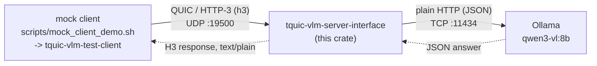

# Mock client verification report

High-level overview of the system this exercises, and wire-level proof that a mock TQUIC client's
image + prompt actually travels the full path — QUIC/H3 client → `tquic-vlm-server-interface` →
VLM backend — rather than the backend being hit directly.

## 1. System overview



| Component | What it is | Where |
|---|---|---|
| Mock client | `scripts/mock_client_demo.sh` downloads a sample image, then runs `tquic-vlm-test-client` (`src/bin/test_client.rs`, already part of this crate) which opens a real `tquic::Endpoint`, TLV-frames the image+prompt (`frames::write_frames`), and POSTs it over QUIC/H3 | Same box as the server for this test |
| TQUIC server | `tquic-vlm-server-interface` — single-threaded `mio` reactor driving one server `tquic::Endpoint`, ALPN `h3`, self-signed TLS, `verify_peer=false` | `target/release/tquic-vlm-server-interface --bind 0.0.0.0:19500 --vlm-base-url http://127.0.0.1:11434/v1 --vlm-model qwen3-vl:8b` |
| Wire protocol (client↔server) | One H3 `POST /v1/infer`, body = two TLV frames (`0x01` image, `0x02` UTF-8 prompt) — see `docs/interface-guide.md` §3 | over UDP :19500 |
| VLM backend | Ollama serving a real vision model, OpenAI-compatible `/v1/chat/completions` | `127.0.0.1:11434`, plain HTTP/1.1 |
| Deployment target | EC2 instance, x86_64 Ubuntu — the real deployment architecture (vs. an aarch64 WSL dev build) | reached over SSH for this test |

The server bridges the two: it parses the TLV frames, base64-embeds the JPEG into a standard
OpenAI vision chat-completion JSON body (`src/vlm_client.rs`), and calls Ollama with a plain
synchronous `ureq` HTTP POST on its own worker thread (so a slow model call never blocks the QUIC
reactor).

## 2. Result

Ran `scripts/mock_client_demo.sh` (image: Wikipedia's mixed-nuts photo; prompt: *"Tell me if there
are peanuts in this image"*) against the live server multiple times. Every run: `status=200`, exit
code `0`, and a real vision-model answer, e.g.:

> "Yes, there are peanuts in the image. The bowl contains a mix of nuts, and several round/oval-shaped
> nuts with light brown coloring (characteristic of peanuts) can be identified among them."

## 3. Proof: the request actually goes client → server → Ollama

The obvious failure mode to rule out is the mock client (or something else) hitting Ollama
directly and the "TQUIC server" being a no-op in between. Reproduced with
`scripts/capture_wire_evidence.sh`, which sniffs both hops on loopback during one request and
samples socket ownership throughout.

**a) Port 19500 carries real QUIC, not plain HTTP.** First bytes of the client's first packet to
`127.0.0.1:19500`:

```
0xcf  00 00 00 01  <20-byte DCID> ...
```

`0xcf` = QUIC long-header, packet type `Initial`; the next 4 bytes are QUIC version `1` (RFC 9000).
This is the one part of a QUIC handshake that's inspectable without the session keys (Initial
packets use publicly-derivable keys); everything after the handshake — the actual H3
request carrying the TLV-framed image+prompt — is TLS-1.3-protected, as expected.

**b) Socket ownership, sampled every 200 ms for the duration of the request:**

```
udp   UNCONN  0.0.0.0:19500              tquic-vlm-serve (pid 15376)   <- listening the whole time
tcp   ESTAB   127.0.0.1:36004 -> :11434  tquic-vlm-serve (pid 15376)   <- appears mid-request
tcp   ESTAB   127.0.0.1:11434 <- :36004  ollama          (pid 6158)
```

The same PID that owns the UDP :19500 listener is the one that opens a fresh outbound TCP
connection to Ollama's :11434 — and only while a request is in flight (it drops to `TIME-WAIT`
once the response lands). `tquic-vlm-test-client`'s PID never appears anywhere near :11434 in any
sample: it has no code path to reach it, only `--host`/`--port` against :19500.

**c) The actual HTTP request the server sent to Ollama** (sniffed on TCP :11434):

```
POST /v1/chat/completions HTTP/1.1
Host: 127.0.0.1:11434
User-Agent: ureq/2.12.1
Content-Type: application/json
Content-Length: 574695

{"messages":[{"content":[
  {"text":"Tell me if there are peanuts in this image","type":"text"},
  {"image_url":{"url":"data:image/jpeg;base64,/9j/4AAQSkZJRgABAgAA...<truncated>"},"type":"image_url"}
  ],"role":"user"}],
 "model":"qwen3-vl:8b"}
```

`User-Agent: ureq/2.12.1` is the exact HTTP client hardcoded in `src/vlm_client.rs` — not
something the QUIC client (which never speaks plain HTTP) could produce.

**d) Ollama's actual response**, also sniffed off the wire:

```json
{"id":"chatcmpl-435","model":"qwen3-vl:8b",
 "choices":[{"message":{"role":"assistant",
   "content":"Yes, there are peanuts in the image...",
   "reasoning":"So, let's look at the image. There's a bowl of mixed nuts..."},
   "finish_reason":"stop"}],
 "usage":{"prompt_tokens":2868,"completion_tokens":221,"total_tokens":3089}}
```

Together, (a)–(d) show the full path is exercised for real: QUIC/H3 client → TLV parse → OpenAI-shape
HTTP call → real vision inference → H3 response back — not a shortcut or a stub answer.

## 4. Reproducing

```bash
# One-shot, no forensics:
./scripts/mock_client_demo.sh

# Same, plus wire-level proof (writes pcaps + a socket-ownership log to /tmp):
./scripts/capture_wire_evidence.sh
```

Both assume `tquic-vlm-server-interface` is already running and pointed at a reachable VLM
backend (see `README.md`'s "Running" section). `capture_wire_evidence.sh` additionally needs
`sudo` for `tcpdump`/`ss` process attribution.
